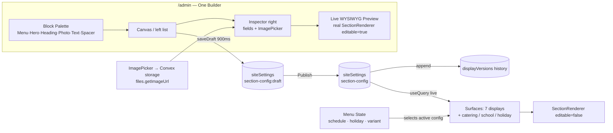
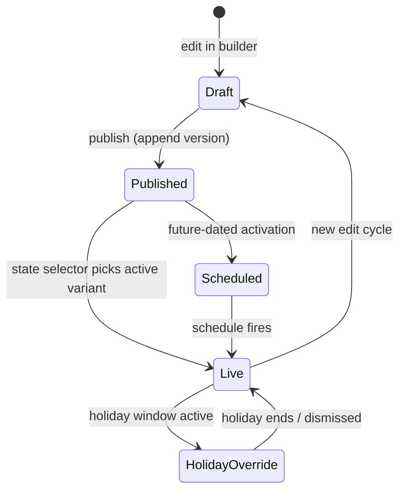

# Universal Display Builder — Design Spec

**Date:** 2026-06-13
**Status:** Approved foundation (Phases 1–5); catering/school/holiday + menu-state pending user review
**Owner constraint:** Build & verify in **dev** (FlowDeck simulator / browser). Code deploys to prod (`cheery-setter-27`) are the owner's call. Data untouched.

## Context

The app already has the bones of an Elementor/Canva-style builder — `SectionComposer` (left inputs / right live WYSIWYG preview, draft → autosave → publish → version history) — but it drives **only** `/tv-info`. Every other surface is hardcoded, sections can't own images, and "composable" is a special case instead of the default.

The goal: invert that. **Every display is a list of blocks. Every block is editable (pictures included). One builder in `/admin` previews exactly what the screen shows.** Then extend the same model to catering, school, dinner, and holiday menus, governed by an explicit **menu-state** model.

The key architectural insight: `SectionRenderer` is already the single render path the TVs use. We make *everything* flow through it instead of building a parallel system.

## Architecture

## Core model

A **surface** is any rendered destination addressed by a stable `slug`. Its content is a `DisplaySectionConfig` (ordered `SectionInstance[]`). Surfaces fall back to a built-in `DEFAULT_SECTION_CONFIGS[slug]` until something is published — publishing is always opt-in, never a forced migration. This is the existing contract; we generalize it.

## Phase 1 — Universal composability (foundation)

- Add **one** section type `menu-category` (wraps the existing `TvCategory`: photo, bilingual + Chinese name, price, allergens; reads `api.menu.getCategoryWithItems`).
- New section component `MenuCategory.svelte`; register it.
- Default configs: `tv-dumplings → [menu-category: steamed-dumplings]`, `tv-noodles → [menu-category: noodle-soups]`.
- Convert `tv-dumplings` / `tv-noodles` `+page.svelte` to the `tv-info` pattern: read published config, fall back to default, render via `SectionRenderer`, pass page-settings as overrides.
- **Valentine variants are a theme skin, not a separate editable page.** `tv-*-valentine` reads the *same* published config as its base slug; the route group only swaps CSS. Edit once, both themes update.
- Register all TV slugs as `composable` in `/admin/displays`.

## Phase 2 — Rich palette + section images

- Extend `SectionPropField.kind` with `'image'`; the inspector renders the existing `ImagePicker` (Library / Upload / URL).
- New `ImageRef` value type: `{ storageId?: Id<'_storage'>; url?: string }`. Resolve at render via a new `convex/files.getImageUrl` query (mirrors the menu-item `resolveImageUrl` pattern). Robust across dev/prod; no expiring URLs baked into config.
- New section types: **Hero/Image** (full-bleed image + optional overlay heading), **Heading** (bilingual title), **Spacer/Divider**.
- Validation in the pure domain module rejects malformed `image` props at write time.

## Phase 3 — Inline photo ownership (the Canva touch)

- `SectionRenderer` gains an `editable` context (default `false`). TVs render `false`; the composer preview renders `true`.
- In editable mode, hovering a menu-item photo reveals an edit affordance → `ImagePicker` → `api.menu.updateMenuItem({ imageStorageId })`. Manage item images *where you compose them.*

## Phase 4 — Builder polish (WYSIWYG, full ownership)

- `/admin/displays` → one builder: block palette · canvas-left · inspector + **device-framed** preview-right.
- Selection highlighting, drag-reorder (exists), empty-state coaching ("introduce, don't assume"), live theme toggle (Standard/Valentine) in preview, dirty / saving / saved / publish states. Deep-link `/admin/displays/compose/[slug]` preserved.
- Discipline: inputs left, live preview right, grid rhythm — per editor design principles.

## Phase 5 — Home menu

- Sectionize `/` (mobile/web digital menu). Default config = hero + `menu-category` per category + info-cards. Heaviest surface; isolated last.

## Phase 6 — Menu variants: catering / school / dinner / holiday (PENDING REVIEW)

These are **surfaces + a state model**, reusing everything above:

- **Catering / events** (`cateringMenus`, `eventPackages`) and **school** (`schoolMeals`) become composable surfaces with their own slugs and a small set of dedicated section types (e.g. `package-card`, `weekly-rotation`).
- **Holiday menus** are a *variant overlay*: a holiday-activated config that supersedes the base surface config while active.

## Menu-State model (PENDING REVIEW — the "really important" part)

Today, menu state is scattered across `siteSettings`: `menu-schedule`, `holiday-prefs`, `page-settings`, plus draft/published configs and `displayVersions`. The rigorous model unifies them into one explicit, auditable state per surface:

- **Variant resolution order** (highest wins): holiday override → scheduled activation → published base → built-in default. One deterministic function, shared by TVs and the builder, so the live screen and the preview can never disagree.
- **Auditable:** every activation/publish appends an immutable `displayVersions` row (already the pattern), extended with `kind` (`sections | holiday | catering | school`) and an activation note.
- Surfaced in the builder as a **state panel**: what's live now, what's scheduled, what holiday overrides exist, with one-click activate / revert.

## Testing & verification

- Pure domain (`sectionConfig.ts`) validation covered by vitest (no browser/db).
- Each phase visually verified in FlowDeck simulator / browser before declaring done; diff behavior vs. `main`.
- Convex mutations reject invalid configs at the boundary so TVs always trust stored data.

## Out of scope (YAGNI)

- Per-section publish workflow (publishing stays atomic per surface).
- New Convex tables for sections (configs stay in `siteSettings` maps + `displayVersions`).
- Ordering/checkout changes.
