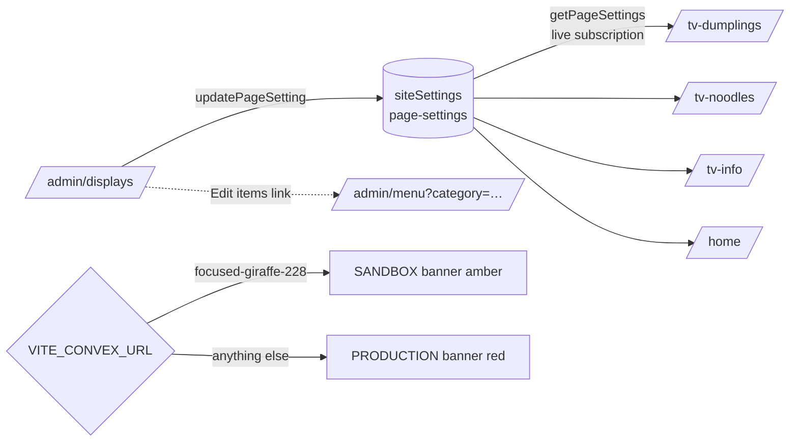

## Context

The owner manages a live restaurant menu shown on physically-mounted portrait TVs (`/tv-dumplings`, `/tv-noodles`, `/tv-info`) and a mobile/home page (`/`). Admin edits must be possible "on a rolling basis" — toggle images, tweak one section — without touching production until explicitly promoted. Two Convex deployments exist: dev sandbox `focused-giraffe-228` (local target, seeded with a snapshot of prod data) and prod `cheery-setter-27` (frozen for this work).

## Goals / Non-Goals

- Goals
  - Per-page visibility toggles (images, Chinese names, allergen badges) that apply instantly to live displays via Convex subscriptions.
  - One admin hub to see and manage every display page in one place.
  - Deterministic environment awareness: admin always shows which deployment it writes to.
  - Zero visual regression for pages with no saved settings.
- Non-Goals
  - Full grid/picture-wall redesign of the TV pages (separate change).
  - Menu switching / scheduled menu rotation (separate change).
  - Migrating TV pages onto `LayoutRenderer` / `displayLayouts` (heavier refactor; revisit later).
  - Automated prod promotion tooling (manual, user-triggered export/import for now).

## Decisions

- Decision: Store per-page settings as ONE `siteSettings` row (`key: "page-settings"`) holding `Record<slug, PageSettings>` rather than a new table or `displayLayouts` rows.
  - Why: no schema change, single-document read (one subscription per TV page), atomic merge-patch writes, matches existing `siteSettings` idiom (`theme`, `menu-schedule`, `customer-info`).
  - Alternatives considered: (a) extend `displayLayouts` with TV slugs — rejected: TV pages don't use `LayoutRenderer` and layouts model structure, not per-page visibility; (b) new `pageSettings` table — rejected: needless schema + migration for 4 small objects.
- Decision: Settings are *optional props defaulting to `true`* on `TvMenuItem`/`TvCategory`.
  - Why: explicit, testable data flow; absent settings render identically to today.
- Decision: Identify pages by route slug strings (`"tv-dumplings"`, `"tv-noodles"`, `"tv-info"`, `"home"`).
  - Why: stable, human-readable keys that survive layout/category renames.
- Decision: Environment banner derives from `VITE_CONVEX_URL` at build/runtime on the client; the dev deployment hostname maps to SANDBOX (amber), anything else to PRODUCTION (red).
  - Why: deterministic, zero-config, impossible to forget; red prod banner is the audit cue the owner asked for.
- Decision: Grouped sidebar nav (Manage: Dashboard, Menu Items, Displays · Configure: Layout, Theme, Schedule, Events · Tools: Live Preview, Print, Analytics).
  - Why: 10 flat entries exceeded scanability; grouping by job-to-be-done is the utilitarian IA requested.

## Risks / Trade-offs

- Stale `value: v.any()` blobs in `siteSettings` are untyped → mitigated with a `PageSettings` interface and a single read/write code path in `convex/settings.ts`.
- TV pages gain one extra subscription (`getPageSettings`) → negligible; single tiny document.
- Slug strings are conventions, not enforced by schema → mitigated by a single `MANAGED_PAGES` constant in the Displays hub used to render all controls.

## Migration Plan

1. Deploy Convex functions to dev sandbox (`bunx convex dev --once`).
2. Ship UI; absent settings ⇒ unchanged rendering (no data migration needed).
3. Promotion to prod is a separate explicit step performed by the owner: deploy functions with `--prod` and (only if desired) carry over the `page-settings` document. Until then, prod stays frozen.
4. Rollback: delete the `page-settings` row; all displays revert to default-on behavior.

## Open Questions

- Should `/order` join the managed pages list? (Deferred until ordering flow is active.)
- Future: per-page font-scale / column-count overrides could merge into `PageSettings` later without schema work.
