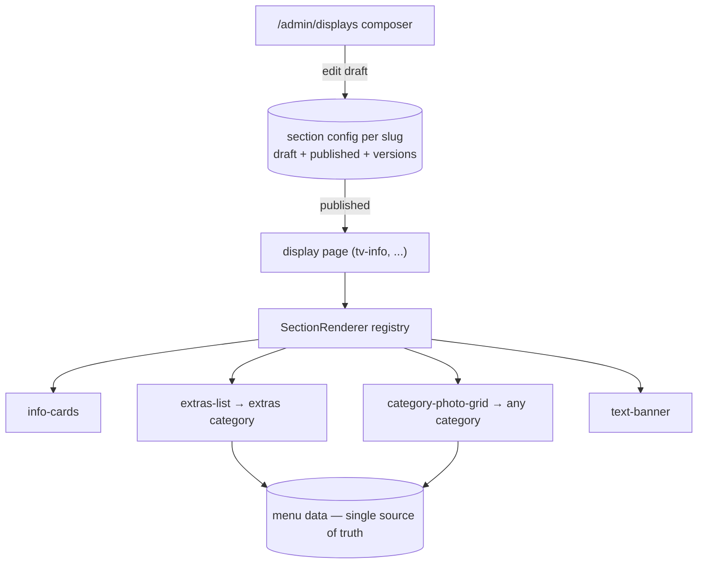

# Design — add-display-section-composer

## Context

Display pages (`tv-info` first) need swappable, reorderable sections managed from admin, with an image-forward category grid as the flagship section type. Current state: `tv-info` hardcodes extras and drinks arrays in the component — already drifted from menu data (Pork extra 79 vs 69 Kč) — and drinks don't exist as data at all. The owner's operating philosophy for this system: determinism and truth (screen state always derivable from versioned data), minimalism and essentialism (build what evidence supports), and memorability (staff can hold the system in their heads as words and actions).

## Goals / Non-Goals

- Goals: data-driven section composition for display pages; category photo grid section; atoms → sections → registry component architecture; composer UI with preview; drinks as real menu data; versioned composition history.
- Non-Goals: drag-and-drop canvas, per-pixel layout, more section types without usage evidence, cross-device carts, user profiles (future changes).

## Decisions

- **Sections are an ordered list, not a canvas.** `DisplaySectionConfig = { sections: Array<{ id, type, props, visible }> }` per page slug. Reordering is up/down moves. Rationale: deterministic rendering, trivially diffable versions, and a page a person can recite — "info cards, extras, drinks grid" — which is the memorability requirement made concrete. Alternatives considered: grid/coordinate layout (rejected — undiffable, unmemorable, invites broken TV states).
- **Registry over conditionals**: `SectionRenderer` maps `type → component` from a typed registry object. Unknown types render nothing and log — a TV must never crash on stale config. Adding a section type = one component + one registry entry + one props schema.
- **Props are validated at write time**: each section type declares a Convex validator for its props; the save mutation rejects malformed configs. Truth at the boundary beats defensive rendering everywhere.
- **All menu-derived sections read the database** (`extras-list` reads the `extras` category; `category-photo-grid` reads any category by id). No literals in section components. This retires the hardcoded-array drift bug class permanently — the print menu, mobile menu, TV, and self-checkout share one source.
- **`category-photo-grid` props**: `categoryId`, `columns (2–4)`, `photoSize (s|m|l)`, `showPrices`, `showChinese`, `maxItems`. Items without photos fall back to a branded placeholder tile rather than breaking the grid rhythm; the composer warns which items lack photos (evidence for where photo work matters).
- **Atoms are extraction, not invention**: `ItemPhoto`, `PriceTag`, `BilingualName`, `SectionTitle` are factored out of existing `Tv*` components so current pages and new sections render identically. Atom = no data fetching, props in → markup out; sections fetch via queries and compose atoms; pages are just config + `SectionRenderer`. Educational doc comments on each atom explain the layer rule.
- **History rides the existing pipeline**: section config is part of the page's draft/publish payload from `add-displays-control-center` — publish snapshots to `displayVersions`, rollback re-publishes. If that change is deferred, a fallback `direct` mode publishes immediately but still appends versions (the black box never has gaps).
- **Drinks seeding is owner-gated data work**: lineup and prices confirmed with owner before seeding (current hardcoded values are the draft proposal); seeded on dev for development, promoted to prod alongside (or before) this change's code so the composed page never renders an empty drinks grid.
- **Evidence loop**: the composer is intentionally minimal (4 section types). Order analytics from `add-ordering-mvp` (top items, category mix) is the input for deciding the next section type — build what the data asks for, not what's imaginable.

## Risks / Trade-offs

- **Rebuilding tv-info risks visual regression on a live screen** → pixel-compare dev render against current prod page before promotion; promotion checklist includes side-by-side screenshots.
- **Config/schema evolution** (section props change shape) → props validators are versioned with defaults for missing fields; unknown props ignored on read.
- **Dependency on displays-control-center** → fallback direct-publish mode (above) keeps this change shippable standalone.
- **Photo quality variance in grids** → placeholder tile + composer warning list; photo grid degrades gracefully rather than gating on complete photography.

## Migration Plan

1. Ship atoms + sections + renderer; `tv-info` reads section config, with a built-in default config identical to today's layout (info-cards, extras-list, drinks-grid-as-photo-grid) so absence of config = current behavior.
2. Seed drinks category (dev → prod with sign-off); flip `extras-list`/photo-grid to database reads.
3. Delete hardcoded arrays in the same PR that ships the default config.
4. Rollback = redeploy previous code; configs are inert to old code.

## Open Questions

- Drinks lineup/prices confirmation (owner) — hardcoded values are the starting proposal.
- Should `tv-dumplings`/`tv-noodles` adopt section composition in this change or stay single-category pages until evidence demands it? (default: tv-info only; the others already work)
