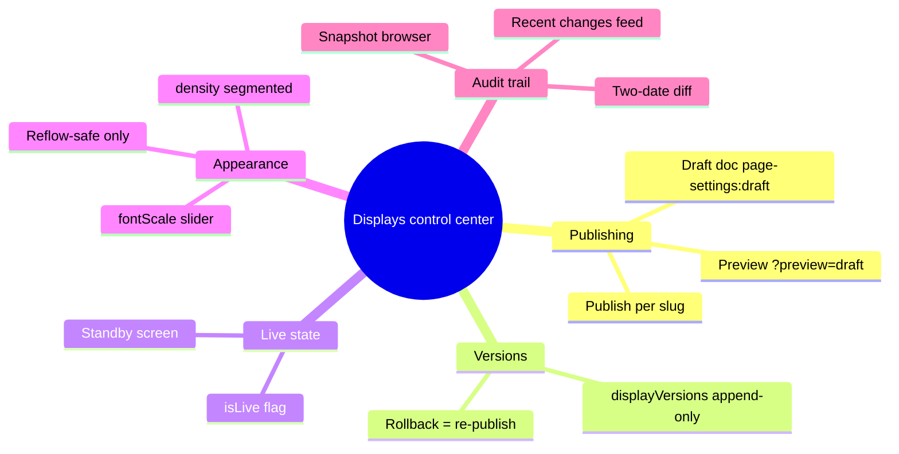

# Design — Displays control center

## Context

`/admin/displays` (from pending change `add-admin-display-controls`) currently writes `page-settings` directly; TVs subscribe live, so every toggle is instantly visible in the restaurant. The owner wants: (a) safe editing that cannot disturb dinner service until explicitly published, (b) a version record of what each screen showed and when, (c) the ability to take a screen offline, (d) bounded visual controls, and (e) a dispute-grade audit trail of menu content drift. Backend primitives `menuArchive` and `dailySnapshots` already exist and are cron-fed (`convex/crons.ts`).

## Goals / Non-Goals

- Goals
  - No edit reaches a live TV without an explicit per-page Publish.
  - Every publish is recorded immutably; any prior version restorable in two clicks.
  - Per-page standby (offline) state with branded fallback screen.
  - Bounded, reflow-safe appearance parameters only.
  - Audit UI answering "what did the menu say on date D?" and "what changed between D1 and D2?".
- Non-Goals
  - Freeform/canvas positioning of elements (explicitly rejected — breaks reflow and accessibility).
  - Scheduled/dated menu publications (separate future change).
  - Auth/multi-user attribution (single owner; `author` field reserved but optional).
  - True network-level unpublishing (standby screen is a content curtain, not a route removal).

## Decisions

- Decision: Draft lives in `siteSettings` key `page-settings:draft`, same shape as `page-settings`.
  - Why: reuses the single-document idiom from `add-admin-display-controls`; one extra subscription only in admin/preview contexts; publish is a copy of one slug's object.
  - Alternatives: per-slug draft rows (more rows, no benefit at 4 pages); branch-style version pointers (overkill).
- Decision: `displayVersions` is a new append-only table `{ slug, settings, version, publishedAt, note? }` with index `by_slug`.
  - Why: dispute-grade history requires immutability; `siteSettings.value: v.any()` blobs cannot index or order versions. Append-only means rollback inserts, never mutates.
- Decision: Rollback re-publishes the selected version as a NEW version.
  - Why: history must never rewrite; the version list remains a faithful timeline of what screens actually showed.
- Decision: Preview via `?preview=draft` query param read client-side; TV page subscribes to the draft doc when set.
  - Why: previews the real route with real data and real CSS at real aspect ratio (scaled iframe in admin); zero extra routes; the param is harmless on physical TVs (never set there).
- Decision: `isLive=false` renders a standby screen inside the TV layout (logo + bilingual "menu temporarily unavailable").
  - Why: physical TVs keep their subscription, so flipping back to live is instant; no deploy, no DNS, no blank screen.
- Decision: Appearance params limited to `fontScale` and `density`, mapped to existing `--tv-*` CSS custom properties.
  - Why: reflow-safe by construction; legibility floors enforced by slider bounds (0.85–1.3); avoids the canvas-serialization trap.
- Decision: Snapshot diff computed in a Convex query (`archive.diffSnapshots`) comparing two `dailySnapshots` by item id.
  - Why: snapshots are small (single-restaurant menu); server-side diff keeps the admin page simple and the logic testable.

## Risks / Trade-offs

- Draft and published docs can drift confusingly → hub shows a per-page "unpublished changes" badge derived from deep-equality check.
- `dailySnapshots` for today is patched by the cron (end-of-day state); intra-day disputes fall back to `menuArchive` per-item rows → audit page surfaces both, labeled clearly.
- `v.any()` settings blobs remain untyped at the DB layer → single `PageSettings` TS interface and one read/write code path in `convex/settings.ts` (same mitigation as parent change).
- Preview param on a production TV by accident → param ignored unless the draft doc exists and differs; standby/live always follows published state only.

## Migration Plan

1. Ship parent change `add-admin-display-controls` (commit working tree, deploy to dev `focused-giraffe-228`).
2. Add `displayVersions` table + settings/archive functions; deploy to dev.
3. First publish from the hub seeds version 1 per page from current published settings.
4. Ship admin UI + TV page changes; verify with Playwright (draft isolation, standby screen, rollback).
5. Prod promotion remains an explicit owner-triggered step (per parent change's workflow constraint).
6. Rollback plan: feature is additive; deleting the draft doc and ignoring `displayVersions` restores parent-change behavior exactly.

## Open Questions

- Standby screen content: static branded screen first; configurable message could be a later `PageSettings` field.
- Should the home page (`/`) get the standby toggle too, or only TV routes? (Default: TV routes only; home stays always-on.)
