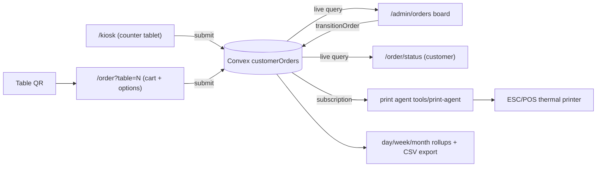

# Design — add-ordering-mvp

## Context

Fulala runs two surfaces off one SvelteKit + Convex app: public menu/TV displays (menu.fulala.cz) and an admin panel. Order capture exists as a session-based cart (`customerOrders` with `active | submitted | completed`), but nothing downstream of submission. The owner wants self-checkout via table QR codes, a staff order board (POS), receipts on a thermal printer, layout templates per display, and full order history/analytics — while keeping the stack lean (no second backend).

## Goals / Non-Goals

- Goals: QR → order → kitchen → done loop with zero staff hand-holding; authoritative item options; realtime order board; printed kitchen tickets/receipts; order history with week/month analytics; per-display layout templates; pure-TS domain core.
- Non-Goals: online payments, freeform layout editor, multi-tenant SaaS, standalone KDS, offline-first PWA.

## Decisions

- **Convex stays the permanent operational core.** Realtime board/status pages fall out of live queries for free. Self-hosting is the escape hatch; analytics export (CSV/NDJSON) provides data ownership and a future Postgres/DuckDB sink. Alternatives considered: NestJS + Postgres (rejected — hand-built realtime, 5–10x code for the same features at restaurant scale).
- **Functional core, imperative shell.** `src/lib/domain/` holds pure modules — `orderStateMachine.ts` (allowed transitions), `pricing.ts` (line totals, VAT, rounding), `optionValidation.ts` (item option config vs. selection). Convex mutations/queries import and apply them; UI imports the same modules for instant client-side validation. This is the SRP/modularity ask, and it makes the brain unit-testable without Convex.
- **Status model**: `active → submitted → preparing → ready → completed`, with `cancelled` reachable from `submitted | preparing | ready`. Existing `completed` rows stay valid; legacy rows read as `source: "qr"`, `fulfillment: "dine-in"`. One general `transitionOrder(id, to)` mutation validates against the state machine (replaces `completeOrder` — **BREAKING** internally, no external consumers).
- **Order taxonomy = source × fulfillment** (the pattern real POS systems converge on): `source: "qr" | "kiosk" | "staff"` records *where the order entered*, `fulfillment: "dine-in" | "takeout"` records *how it leaves*. The locator is the table number for dine-in and the daily order number for takeout/kiosk. All sources converge on one realtime queue; cards and kitchen tickets render a source badge + locator. Alternative considered: a single `orderType` enum (rejected — conflates two axes, e.g. kiosk eat-in vs kiosk takeaway).
- **Kiosk mode is a route, not an app**: `/kiosk` runs fullscreen on a counter tablet (browser kiosk/guided-access mode — no device management). Flow follows the proven fast-casual pattern: attract screen → eat-in/takeaway upfront → category rail + item grid with ≥60px touch targets and a persistent Back → modifier sheet → persistent bottom cart bar → submit → big on-screen order number. Idle reset: 45s inactivity shows a 15s "Still there?" overlay, then clears the cart to the attract screen. Each completed order rotates the sessionId so orders never bleed between customers. v1 has no kiosk payment — the customer pays at the counter when the number is called.
- **Table map = fixed grid of tiles, not a floor-plan canvas**: tiles come from the `tables` registry, each showing state (empty / open order), elapsed time since submission, and check total; tap opens that table's orders. Color aging gray→green→yellow→red. Freeform drag-and-drop floor plans (Toast/Square) add near-zero value at ~a dozen tables — explicitly skipped.
- **Order board follows KDS conventions**: status columns as card rails; order-level bump only (one kitchen, no stations); header aging green 0–5 min / yellow 5–8 / red 8+ (configurable later); audible beep + flash on arrival; "Recall last" undoes an accidental bump; tapping an item line toggles strikethrough as a lightweight prep marker.
- **Daily order numbers**: `orderNumber` = sequence per local day (Europe/Prague), assigned at submission inside the mutation (Convex mutations are serializable — no race). Display as `#42`, reset daily; uniqueness key `(dayKey, orderNumber)`.
- **VAT made explicit**: current code hardcodes 10% tax; Czech VAT for restaurant food is 12% (drinks differ). Tax rate moves to a `siteSettings` key (`vat-config`) applied by `pricing.ts`; the rate is configuration, not code. Existing stored totals are not retro-recomputed.
- **Tables registry**: small `tables` table (`number`, `label`, `isActive`) instead of free-text — QR posters, board labels, and validation all read from it. "Counter" is table 0.
- **QR codes**: generated client-side in admin (tiny QR lib) onto a printable A4 poster sheet; URLs are stable (`https://menu.fulala.cz/order?table=N`), so posters survive redeploys.
- **Print agent topology**: `tools/print-agent/` — a ~150-line Node service running on the shop mini-PC/Pi, using the Convex JS client to subscribe to `orders.getPrintQueue` (orders submitted since agent start, plus explicit reprint requests via a `printJobs` table). Prints kitchen ticket on `submitted`, receipt on demand. Printer offline ⇒ jobs stay queued in `printJobs` (status `pending | printed | failed`), agent retries; order flow never blocks on printing. Alternatives considered: cloud-print APIs (rejected — vendor lock-in, monthly fees), printing from the browser (rejected — unreliable, no kitchen automation).
- **Analytics rollups, not a warehouse**: history queries hit `customerOrders` indexes (`by_status`, `by_day`); week/month cards aggregate on read for ranges ≤ 90 days (hundreds of orders/day ⇒ trivial). A `convex/http.ts` action streams CSV/NDJSON for DuckDB/Postgres. Pre-aggregated tables are deferred until read cost is measurable (and `rework-display-analytics` owns display-traffic analytics — order analytics deliberately lives with orders).
- **Layout templates per display page**: extend `displayLayouts` with optional `pageSlug` (`tv-dumplings | tv-noodles | tv-info | home | order`); resolution order: page-slug match → pageType default → standard-list. Template cards in `/admin/displays` show a mini static preview per layout type; assignment writes `pageSlug`. Composes with `add-displays-control-center` drafts if that ships (assignment becomes part of the draft payload then).

## Risks / Trade-offs

- **Live TVs share the prod deployment** → all work on dev sandbox; prod promotion is an explicit owner-approved step (per repo convention in `.env.local`).
- **Print agent is a single point of failure for tickets** → board is the source of truth; agent failure degrades to staff reading the board; `printJobs` queue preserves unprinted tickets for retry.
- **Schema extension on a live table** (`customerOrders`) → all new fields optional with read-time defaults; no migration of historical rows needed.
- **ESC/POS printer variance** → agent isolates printer driver behind one module; tested against the shop's actual printer model before sign-off (model TBD with owner — task 4.1).
- **Read-time aggregation could get slow at scale** → indexes by day; revisit with pre-aggregation only if p95 query time degrades.

## Migration Plan

1. Schema fields land as optional; deployed code treats absence as defaults (`source: "qr"`, `fulfillment: "dine-in"`, VAT 10% until `vat-config` set).
2. `completeOrder` removed in the same deploy that ships `transitionOrder` (single app, no API consumers).
3. Rollback = redeploy previous code; data fields are additive and inert to old code.

## Open Questions

- Thermal printer model + interface (USB/network) — determines ESC/POS driver config (blocking only for task group 4).
- Should sit-in manual orders require a table assignment, or allow "unassigned"? (default: required, counter = 0)
- VAT split for drinks (21%) vs food (12%) — v1 applies one configurable rate; per-category rates if the accountant needs them.
