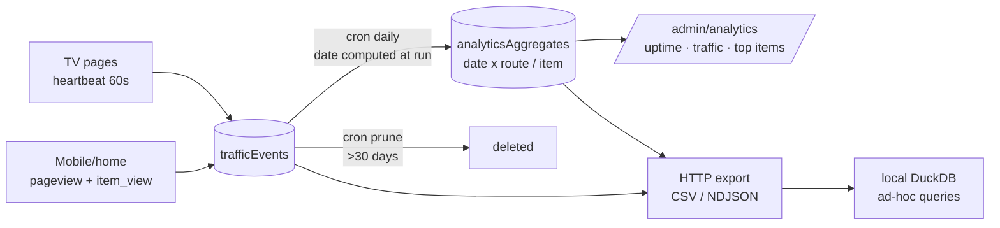

# Design — rework-display-analytics

## Context

A single restaurant with ~3 always-on portrait TVs and a public mobile/home menu page. Data volume is tiny (hundreds of events/day), so the constraint is **trustworthiness and honesty of metrics**, not scale. Convex is the live system of record; DuckDB is the owner's preferred local analysis tool. Current capture is broken in ways documented in the proposal (frozen cron date, never-ending TV sessions, no route/item dimensions).

## Goals / Non-Goals

- Goals
  - Every number shown in the admin is computable from raw events and labeled with what it measures.
  - TV health expressed as uptime (heartbeat coverage), visitor traffic as pageviews/uniques by route and hour, popularity as item interactions.
  - One-command path from export to DuckDB.
- Non-Goals
  - Order/revenue analytics (no active ordering flow yet).
  - Embedded DuckDB-WASM, external analytics SaaS, or any new infrastructure.
  - Per-visitor identity, fingerprinting, or anything requiring a cookie banner — sessionId stays an ephemeral per-load random id, no PII.

## Decisions

- Decision: One `trafficEvents` table `{ type: 'pageview'|'heartbeat'|'item_view', route, sessionId, ts, viewport?, itemId? }`, indexes `by_ts` and `by_type_ts`.
  - Why: single append-only stream is trivially exportable and aggregatable; types are a closed union; at this volume one table beats three.
  - Alternatives: keep session rows and patch them (rejected — patching is what made durations fiction); per-type tables (rejected — needless joins at toy scale).
- Decision: TV metric is uptime minutes/day derived from heartbeat count × interval, per route.
  - Why: a wall-mounted display has no "session"; the operationally useful question is "was the screen showing the menu during opening hours?". Heartbeats also double as a liveness alarm later.
- Decision: `aggregateDaily` computes its target date at execution time (`args.date` optional → defaults to yesterday UTC).
  - Why: fixes the frozen-date deploy bug at the root; explicit arg retained for backfills.
- Decision: Raw events pruned after 30 days; aggregates immortal.
  - Why: Convex storage stays bounded; 30 days of raw is enough to re-derive or debug any aggregate; long-horizon questions use aggregates or prior exports.
- Decision: Export is a Convex HTTP action streaming CSV (default) or NDJSON for a date range, secured with a static token in the URL (single owner, read-only data, no PII).
  - Why: DuckDB ingests both formats natively (`read_csv_auto`, `read_json_auto`); zero client tooling. Parquet rejected: needs a writer dependency for no benefit at this size.
- Decision: `item_view` fires when a visitor expands/taps an item card on mobile/home only.
  - Why: the only honest popularity proxy available; TVs are passive glass. The dashboard labels it "viewed by visitors", never "popular orders".

## Risks / Trade-offs

- Heartbeats from an admin preview iframe would pollute TV uptime → beacons disabled when `preview=draft` param or admin referrer is present.
- Migration of old `displayAnalytics` rows is lossy (no routes recorded) → migrate counts into a clearly-labeled `legacy` route bucket, or drop after owner confirms; decide at implementation.
- Static export token is weak security → acceptable for non-PII read-only menu traffic; revisit if auth lands project-wide.
- 60s heartbeat × 3 TVs ≈ 4.3k writes/day → trivial for Convex; prune cron keeps the table small.

## Migration Plan

1. Add `trafficEvents` + reshaped aggregates to schema; deploy to dev.
2. Fix cron date bug (independent, ships immediately even before the rest).
3. Add beacons to layouts/components behind a tiny `track()` helper (no-op during SSR and preview).
4. Rebuild aggregation + admin page; verify against a day of dev data.
5. Export action + DuckDB docs in the Analytics page.
6. Decide legacy `displayAnalytics` disposition with owner (migrate-to-legacy-bucket vs drop).
7. Rollback: beacons are fire-and-forget; removing them reverts capture; old queries remain until deleted.

## Open Questions

- Opening-hours window for uptime percentage (e.g., 10:00–21:00 local) — confirm hours so "uptime" reflects service time, not 24h.
- Should the home page hero also emit `item_view` for featured items? (Default: yes, same component.)
