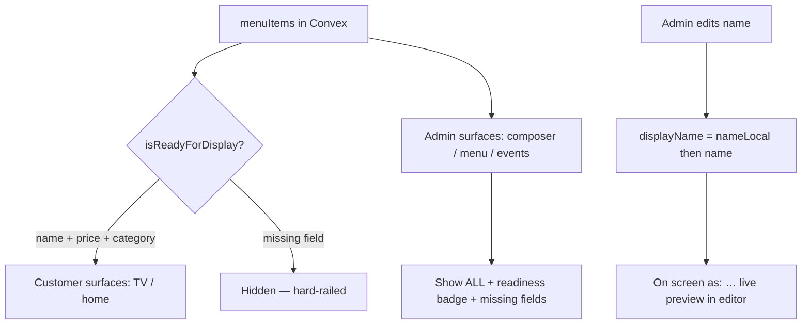

# Ship the June version to production — cleanly, with safeguards

Plan: ~/.claude/plans/zesty-tumbling-biscuit.md (approved 2026-06-13)

- [x] Phase 0: Backup prod Convex data (cheery-setter-27) → backups/ (2.8MB, verified)
- [x] Phase 1: Gate /order behind admin flag (default OFF) + admin toggle + test (commit fb0a7c4)
- [x] Phase 2: Deploy Convex backend to prod cheery-setter-27 → LIVE TVs RECOVERED, console clean, data intact
- [x] Phase 4: June frontend LIVE (BPgIFmZh). Verified: tv-dumplings identical, /order gated,
      tv-info shows safe discount fallback, console clean on all pages
- [x] Phase 3: Seeded extras(6)+drinks(5)+baos(2)+rice(1)+wontons(1). Verified: 7 cats/28 items,
      original 13 intact, all 5 drink images load, 0 broken images, showing live on /
- [x] Phase 5a: backup:prod script + DEPLOYMENT.md runbook (useQuery onError shipped in fb0a7c4)
- [ ] Phase 5b: branch protection (block force-push/deletion on main)
- [ ] Phase 5c: atomic-deploy wiring — BLOCKED on owner adding CONVEX_DEPLOY_KEY to Vercel
- [ ] Phase 6: Compose /tv-info — swap discounts→extras+drinks (with owner's visual review;
      live physical screen, don't publish unreviewed)

## Phase 7 — Menu sync hardening + production-ready gate (provisioning)

Two real defects, customer-facing:
1. **Name edits didn't reach /tv** — admin's prominent field is "Name (EN)"→`name`,
   but the TV headline is `nameLocal || name`. Editing EN never moves a CZ-headlined
   title. Feature tags toggled visibly → "tags updated, names didn't."
2. **Incomplete items leak to customers** — new items are created with `price: 0`,
   so a half-built draft shows on the TVs/home as "Nová položka — 0 Kč."

Fix on the FRONTEND display layer only (prod backend deploys are forbidden per the
June 13 incident — backend gating would need a deploy and risks desync). A shared
pure domain module is the single source of truth, unit-tested.

- [x] `src/lib/domain/menuItem.ts` — `displayName`, `secondaryName`, `hasValidPrice`,
      `menuItemReadiness`, `isReadyForDisplay`, `readinessSummary` (pure, doc-commented)
- [x] `src/lib/domain/menuItem.test.ts` — vitest, 20 tests: precedence + gate + edges
- [x] Gate customer surfaces: MenuCategory, CategoryPhotoGrid, ExtrasList, Menu, home `+page`, LayoutRenderer
- [x] Admin transparency: MenuItemEditor ("On screen as" preview + readiness pill + relabeled fields);
      SectionItemsEditor + /admin/menu list now headline displayName (Czech) with English STACKED under
      + per-item "Draft — hidden from screens" badge — admin list now mirrors the TV by eye
- [x] Verify: vitest 20/20; svelte-check 0 errors; verified live in browser against REAL PROD data —
      shrimp name edit synced to TV, admin list mirrors TV, incomplete items hard-railed, console clean
- [x] Database sync: repointed local `.env.local` to production (cheery-setter-27) — single source of
      truth; backed up prod first (backups/prod-2026-06-13-0645.zip). `.env.local` is gitignored.

## Review

(to be filled after completion)

---

# Universal Display Builder

Spec: `docs/superpowers/specs/2026-06-13-universal-display-builder-design.md`
Rule: build + verify in dev (FlowDeck / browser). No prod deploys.

## Phase 1 — Universal composability (foundation) ✅ DONE
- [x] Add `menu-category` section type to `src/lib/domain/sectionConfig.ts` (spec + fields)
- [x] Add `DEFAULT_SECTION_CONFIGS` for `tv-dumplings`, `tv-noodles`
- [x] Create `src/lib/components/sections/MenuCategory.svelte` (wraps `TvCategory`, reads `getCategoryWithItems`)
- [x] Register `menu-category` in `src/lib/components/sections/registry.ts`
- [x] Convert `tv-dumplings/+page.svelte` to SectionRenderer + published config + default fallback
- [x] Convert `tv-noodles/+page.svelte` likewise
- [x] Point dumplings/noodles Valentine variants at the same base-slug config (theme = skin only)
      (tv-info-valentine deferred: bespoke hand-styled markup; needs theme-aware sections — Phase 4)
- [x] Mark tv-dumplings + tv-noodles `composable` in `/admin/displays/+page.svelte` (home → Phase 5)
- [x] Verify: 12/12 vitest pass; svelte-check 0 errors; all 3 TVs + valentine + composer screenshotted, render identical

## Phase 2 — Inline item editing + builder craft ✅ DONE (reprioritized per owner)
- [x] `SectionItemsEditor.svelte` — edit each item's CZ/EN/Chinese text, price, availability,
      photo (ImagePicker: Library/Upload/URL) + "+ Add item", inline, writing live to the menu
- [x] Wire composer to `updateMenuItem` / `createMenuItem` / `generateImageUploadUrl`
- [x] Collapsible section cards (bits-ui/melt-ui Collapsible), collapsed by default to save space
- [x] Preview fit-to-box (scales to width AND height) — always fully visible, sticky
- [x] Design pass: iA-Writer editorial — DM Mono labels, Cormorant names, paper/ink, red accent
- [x] Verify: svelte-check 0 errors; composer + item editing + image picker screenshotted, console clean

## Phase 2b — Rich palette + section-level images (still pending)
- [ ] `kind: 'image'` + `ImageRef` + validation; `convex/files.getImageUrl`
- [ ] New section types: Hero/Image, Heading, Spacer/Divider

## Phase 3 — In-preview photo ownership (still pending)
- [ ] `editable` context in SectionRenderer; click-to-swap photos directly in the preview canvas

## Phase 4 — Builder polish (WYSIWYG)
- [ ] Palette panel, selection states, device-framed preview, theme toggle, empty states

## Phase 5 — Home menu
- [ ] Sectionize `/`

## Phase 6 — Variants + menu state (PENDING REVIEW)
- [ ] Catering / school / holiday surfaces; unified menu-state resolution + state panel
